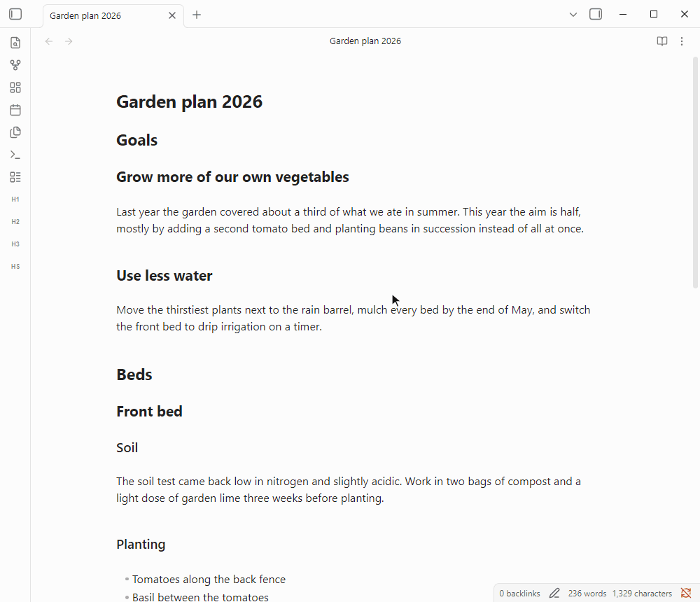
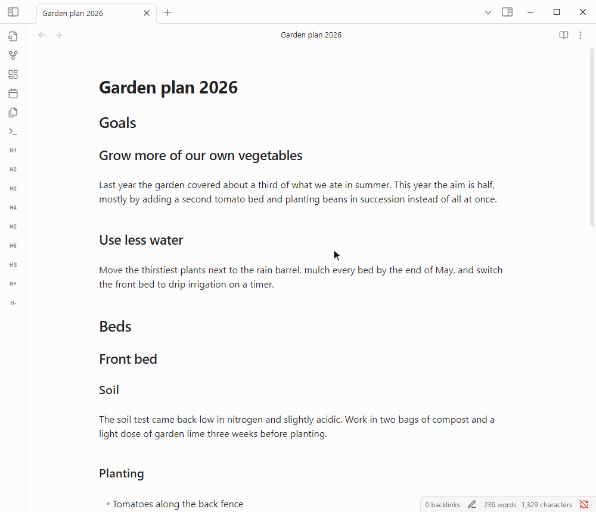
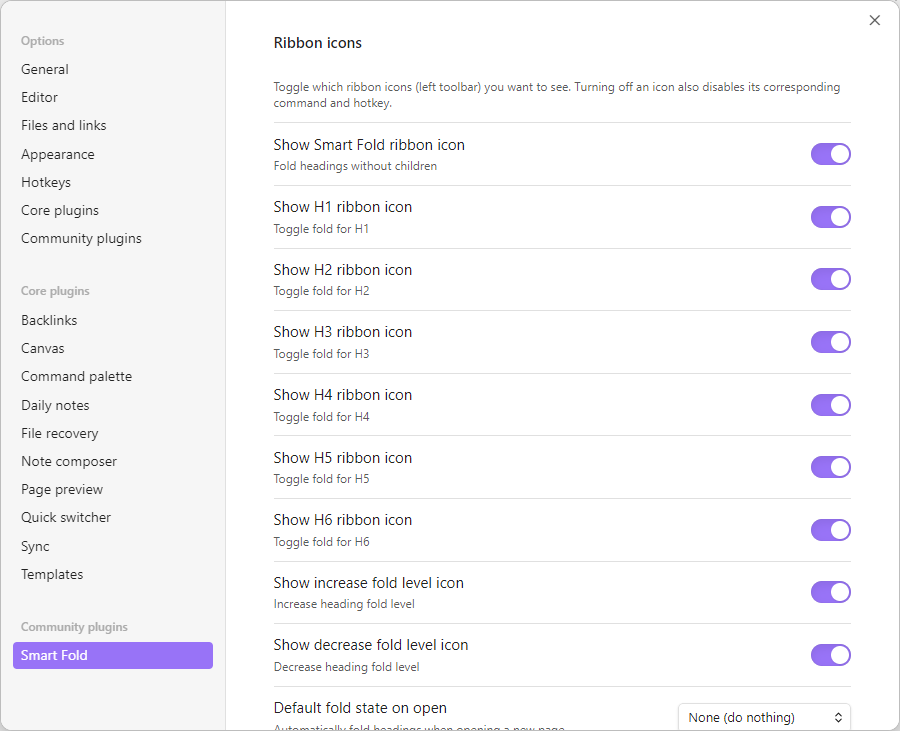

# Smart Fold for Obsidian

Smart Fold turns a long Markdown note into a readable outline with one click.



Its main feature is **Smart Fold**, which folds every heading that has no subheadings of its own. Those are the sections that hold the actual text, so folding them hides the long paragraphs and lists while every parent heading stays open. The note reads like an outline instead of a wall of text, and one more click brings everything back.

This is especially useful for meeting notes, research notes, project plans, long reading notes, and any document where the structure matters more than the details while you review it.

## Features

- **Smart Fold for leaf headings**: fold or unfold every heading without subheadings in one step, keeping the whole hierarchy visible.
- **Step through heading levels**: fold one heading level deeper or shallower at a time with **H-** and **H+**, until the note shows exactly as much detail as you want.
- **Fold a single heading level**: toggle all H1, H2, H3, H4, H5 or H6 headings of the note at once.
- **Fold on open**: have every note you open start in Smart Fold or folded to a chosen heading level.
- **Ribbon icons and hotkeys**: every action has its own ribbon icon and command, so you can click it or give it a hotkey.
- **Only the tools you use**: turning an icon off in the settings also removes its command and hotkey, which keeps the ribbon and the command palette uncluttered.
- **Native Obsidian folding**: Smart Fold uses the same folds as the arrows next to your headings. Nothing is written into your notes, and you can open any single section again by clicking its arrow.

## How it works

### Smart Fold

Click the **HS** icon in the left ribbon, or run **Smart Fold: Toggle fold for headings without children** from the command palette.

A heading counts as a leaf when the next heading after it is at the same level or higher, so no subheading sits under it. Smart Fold folds all leaf headings of the current note and leaves every other heading open. In the example above, **Goals**, **Beds**, **Front bed** and **Schedule** stay open because they contain subheadings, while sections such as **Soil**, **Back bed** and **Budget** fold away.

Running Smart Fold again unfolds the same sections. Folds you made by hand on other headings are kept either way.

### Folding level by level



- **H-** folds the deepest heading level that is still open. In a note with headings down to H4, the first click folds all H4 sections, the next folds H3, then H2.
- **H+** does the opposite and opens the shallowest folded level together with every level above it, so repeated clicks reveal the note one level at a time.

The matching commands are **Decrease heading fold level** and **Increase heading fold level**.

### Folding one heading level

The **H1** to **H6** icons each toggle all headings of that level in the current note. If the first heading of that level is folded, all of them are unfolded, otherwise all of them are folded. The matching commands are **Toggle fold for H1** to **Toggle fold for H6**.

### Fold on open

Under **Settings → Smart Fold → Default fold state on open** you can choose what happens whenever you open a note.

- **None**: notes open as they are. This is the default.
- **Fold H1** to **Fold H6**: all headings of that level are folded.
- **Smart Fold**: the note opens in outline mode, with all leaf headings folded.

## Settings



- **Ribbon icons**: choose which of the icons **HS**, **H1** to **H6**, **H+** and **H-** appear in the left ribbon. Turning an icon off also disables its command and any hotkey assigned to it. Turning it back on restores it to its previous place in the ribbon.
- **Default fold state on open**: see [Fold on open](#fold-on-open).

To assign hotkeys, open Obsidian's **Settings → Hotkeys** and search for `Smart Fold`.

## Installation

1. Open **Settings → Community plugins** in Obsidian and turn off Restricted mode if it is on.
2. Click **Browse**, search for **Smart Fold**, then install and enable it.

If Smart Fold does not show up in the Community Plugins browser yet, install it manually. Download `main.js` and `manifest.json` from the [latest release](https://github.com/shenfan19/obsidian-smart-fold/releases), copy them into `<your-vault>/.obsidian/plugins/smart-fold/`, reload Obsidian and enable **Smart Fold** under **Settings → Community plugins**.

## Development

The project requires **Node.js >= 24.11.1**. You can install dependencies and build it using:

```bash
npm install
npm run build
```

## Credits

- **Inspiration**: This plugin's core folding logic directly references and is inspired by the exceptional work done in [obsidian-creases](https://github.com/liamcain/obsidian-creases) by Liam Cain. His project is licensed under the MIT License, and I retain the spirit of open-source sharing by also releasing this plugin under MIT.
- **AI Assistance**: The development, refactoring, and refinement of this plugin were assisted by **Antigravity**, an advanced agentic AI coding assistant developed by Google Deepmind.
