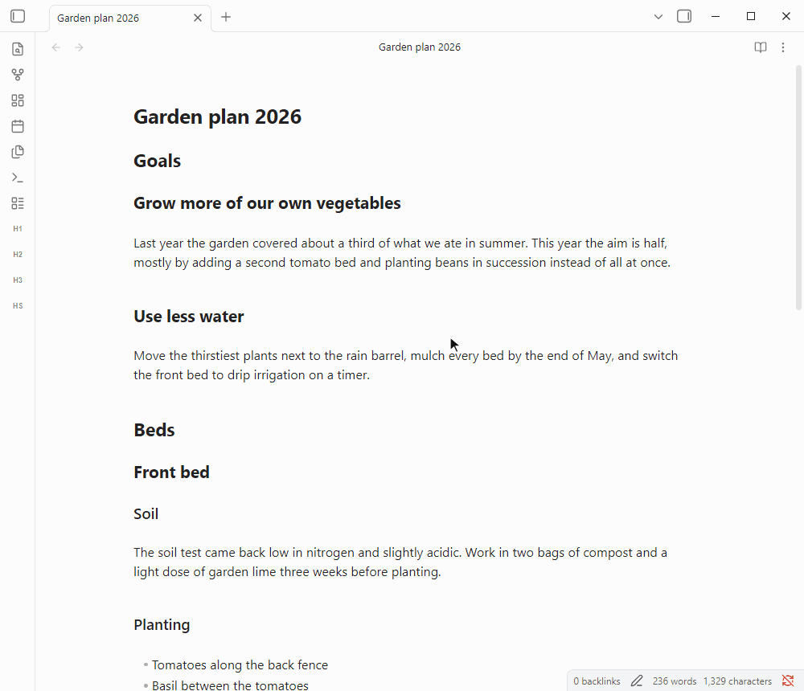

# Smart Fold

**Smart Fold** is a plugin for [Obsidian](https://obsidian.md) that turns a long Markdown note into a readable outline with one click.

**HS folds every section that has no subheadings**, so the paragraphs disappear and the outline stays. Click again to bring everything back.

**H1, H2 and H3 fold all headings of one level at once.**

**H- and H+ fold and unfold one level at a time.**

## Features

- **HS, Smart Fold**: folds every heading that has no subheading under it, which are the sections holding the actual text. Parent headings stay open, folds you made by hand are kept, and a second click unfolds the same sections.
- **H1 to H6**: each toggles all headings of that level. If the first one is folded, all of them unfold, otherwise all of them fold.
- **H- and H+**: H- folds the deepest level that is still open, and H+ opens the shallowest folded level together with every level above it.
- **Fold on open**: under **Settings → Smart Fold → Default fold state on open**, notes can open in Smart Fold or folded to a chosen heading level.
- **Native folding**: Smart Fold uses the same folds as the arrows next to your headings. Nothing is written into your notes, and any single section opens again with its arrow.

Every action is a ribbon icon and a command, so you can click it or give it a hotkey under **Settings → Hotkeys**. **HS** and **H1** to **H3** are on by default. The other icons can be turned on under **Settings → Smart Fold**, and turning an icon off also removes its command and hotkey.

## Installation

Search for **Smart Fold** under **Settings → Community plugins → Browse**, then install and enable it. To install manually, copy `main.js` and `manifest.json` from the [latest release](https://github.com/shenfan19/smart-fold/releases/latest) into `<your-vault>/.obsidian/plugins/smart-fold/`.

## Development

The project requires Node.js 24.11.1 or later. `npm install` and `npm run build` write `main.js` to the repository root. Releases are built and published by GitHub Actions from a version tag, and the steps are described at the top of `.github/workflows/release.yml`.

## Credits

- **Inspiration**: This plugin's core folding logic directly references and is inspired by the exceptional work done in [obsidian-creases](https://github.com/liamcain/obsidian-creases) by Liam Cain. His project is licensed under the MIT License, and I retain the spirit of open-source sharing by also releasing this plugin under MIT.
- **AI Assistance**: The development, refactoring, and refinement of this plugin were assisted by **Antigravity**, an advanced agentic AI coding assistant developed by Google Deepmind.
